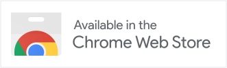

<div align="center">
  <a href="https://abdownloadmanager.com" target="_blank">
    
  </a>
</div>
<h1 align="center">AB Download Manager</h1>
<p align="center">
    <a href="https://github.com/amir1376/ab-download-manager/releases/latest"></a>
    <a href="https://abdownloadmanager.com"></a>
    <a href="https://t.me/abdownloadmanager_discussion"></a>
    <a href="https://t.me/abdownloadmanager"></a>
    <a href="https://crowdin.com/project/ab-download-manager"></a>
</p>

<a href="https://abdownloadmanager.com" target="_blank">
    
</a>


## Description

[AB Download Manager](https://abdownloadmanager.com) is a desktop app which lets you manage and organize your download files better than before

## Features

- ⚡️ Faster Download Speed
- ⏰ Queues and Schedulers
- 🌐 Browser Extensions
- 💻 Multiplatform (Windows / Linux / Mac)
- 🌙 Multiple Themes (Dark/Light) with modern UI
- ❤️ Free and Open Source

Please visit [Project Website](https://abdownloadmanager.com) for more info

## Installation

### Download and Install the App

<a href="https://abdownloadmanager.com"></a>

<a href="https://github.com/amir1376/ab-download-manager/releases/latest"></a>

#### installation script (Linux)

```bash
bash <(curl -fsSL https://raw.githubusercontent.com/amir1376/ab-download-manager/master/scripts/install.sh)
```

#### winget or scoop (for Windows)

**winget**:

```bash
winget install amir1376.ABDownloadManager
```

**scoop**:

```bash
scoop install extras/abdownloadmanager
```

### Browser Extensions

You can download the browser extension to integrate the app with your browser

<p align="left">
<a href="https://addons.mozilla.org/firefox/addon/ab-download-manager/"></a>
<a href="https://chromewebstore.google.com/detail/bbobopahenonfdgjgaleledndnnfhooj">
    <picture>
        <source media="(prefers-color-scheme: dark)" srcset="./assets/banners/chrome-extension_dark.png" height="50">
        <source media="(prefers-color-scheme: light)" srcset="./assets/banners/chrome-extension_light.png" height="50">
        
    </picture>
</a>
</p>

## Screenshots

<div align="center">
<picture>
  <source media="(prefers-color-scheme: dark)" srcset="./assets/screenshots/app-home_dark.png">
  <source media="(prefers-color-scheme: light)" srcset="./assets/screenshots/app-home_light.png">
  
</picture>

<picture>
  <source media="(prefers-color-scheme: dark)" srcset="./assets/screenshots/app-download_dark.png">
  <source media="(prefers-color-scheme: light)" srcset="./assets/screenshots/app-download_light.png">
  
</picture>
</div>

## Project Status & Feedback

Please keep in mind that this project is in the beginning of its journey.
**lots of features** are on the way!.

**But**, in the meantime you may face **Bugs or Problems**. so.
Please report them (by [Community chat](#community) or `GitHub Issues`) to me,And I'll do my best to fix them ASAP

## Community

You can join to our [Telegram Group](https://t.me/abdownloadmanager_discussion) to

- Report problems
- Suggest features
- Get help about the app

## Repositories And Source Code

There are multiple repositories related to the **AB Download Manager** project

| Repository                                                                                 | Description                                                                   |
|--------------------------------------------------------------------------------------------|-------------------------------------------------------------------------------|
| [Main Application](https://github.com/amir1376/ab-download-manager) (You are here)         | Contains the  **Application** that runs on your  **device**                   |
| [Browser Integration](https://github.com/amir1376/ab-download-manager-browser-integration) | Contains the **Browser Extension** to be installed on your  **browser**       |
| [Website](https://github.com/amir1376/ab-download-manager-website)                         | Contains the **AB Download Manager** [website](https://abdownloadmanager.com) |

I spent a lot of time to create this project.

If you like my work, Please consider giving it a ⭐ Thanks ❤️

## Bug Report

If you see bugs in the source code! please report them in the `GitHub Issues` section

## Build From Source

to compile and test desktop app on your local machine
follow these steps.

1. Clone the project
2. Download and extract the [JBR](https://github.com/JetBrains/JetBrainsRuntime/releases) and make it available by either
    
    - adding it to your `PATH`, or
    - setting the `JAVA_HOME` environment variable to its installation path.
  
3. cd into the project, open your terminal and execute the following command

    ```bash
    ./gradlew createReleaseFolderForCi
    ```

4. The output will be created in:

    ```
    <project_dir>/build/ci-release
    ```

> **Note**. This project is compiled and published by GitHub actions [here](./.github/workflows/publish.yml), so if you
> faced any problem you can check that too

## Translations

If you’d like to help translate AB Download Manager into another language, or improve existing translations, you can do
so on Crowdin. Here’s how:

- Visit the project in [Crowdin](https://crowdin.com/project/ab-download-manager)
- Please DO NOT submit translations via pull requests.
- If you want to add a new language, please see [here](https://github.com/amir1376/ab-download-manager/issues/144)

## Contribution

Contributions to this project are very welcome!

If you want to contribute to this project, please read [Contributing Guide](CONTRIBUTING.md) first.

Let's make a better Download Manager together ❤️

## Support the Project

If you'd like to support the project, you can find details on how to donate in the [DONATE.md](DONATE.md) file.
