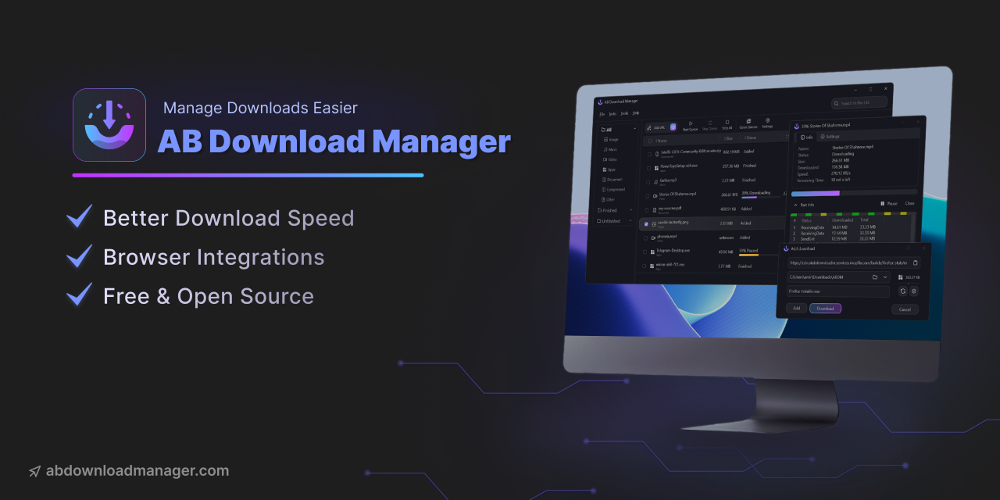
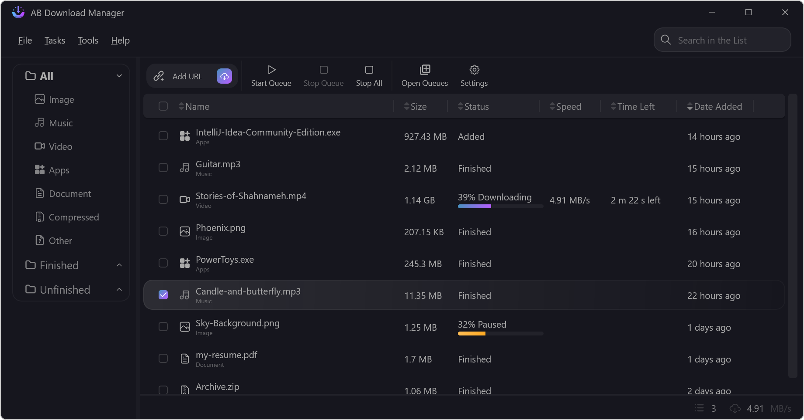
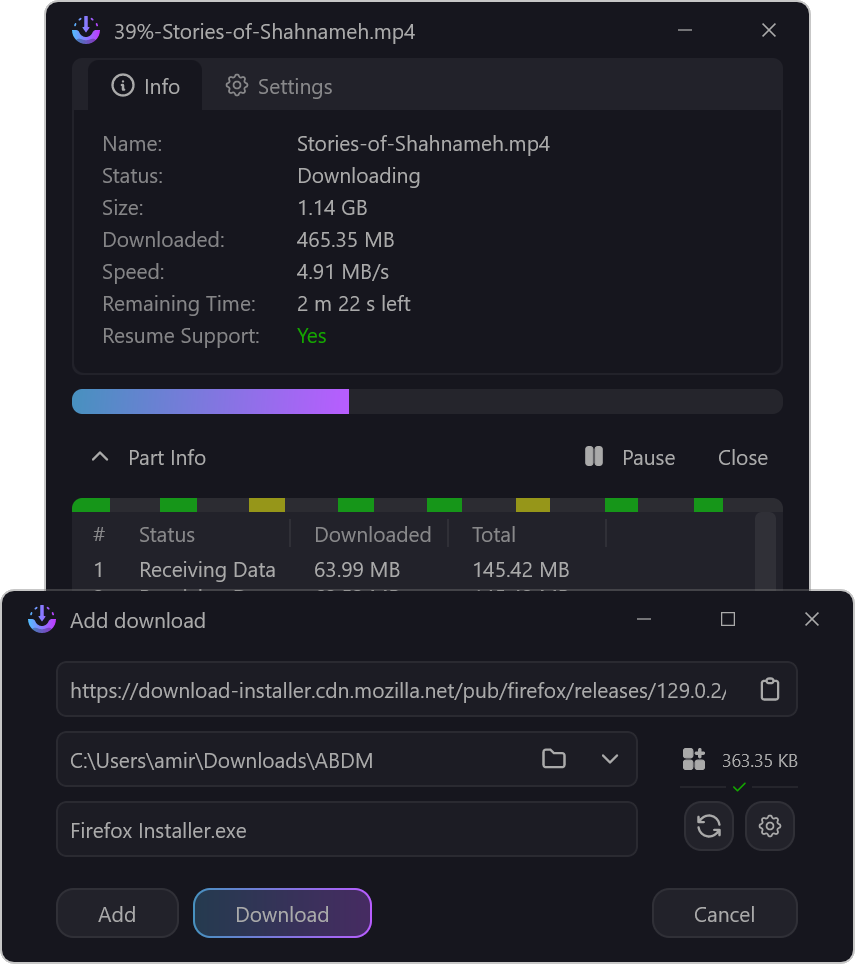

<div align="center">
  <a href="https://abdownloadmanager.com" target="_blank">
    
  </a>
</div>
<h1 align="center">AB Download Manager</h1>
<p align="center">
    <a href="https://github.com/amir1376/ab-download-manager/releases/latest"></a>
    <a href="https://abdownloadmanager.com"></a>
    <a href="https://t.me/abdownloadmanager_discussion"></a>
    <a href="https://t.me/abdownloadmanager"></a>
    <a href="https://crowdin.com/project/ab-download-manager"></a>
</p>

<a href="https://abdownloadmanager.com" target="_blank">
    
</a>


## Description

[AB Download Manager](https://abdownloadmanager.com) is a desktop app which lets you manage and organize your download files better than before

## Features

- ⚡️ Faster Download Speed
- ⏰ Queues and Schedulers
- 🌐 Browser Extensions
- 💻 Multiplatform (Windows / Linux for now)
- 🌙 Multiple Themes (Dark/Light) with modern UI
- ❤️ Free and Open Source

Please visit [Project Website](https://abdownloadmanager.com) for more info

## Installation

in order to download and install the app

- You can visit [Project Website](https://abdownloadmanager.com) for Download Instructions
- using an installation script
  - <details>
    <summary>bash script (Linux)</summary>

    you can run this to install or update existing installed version
    ```bash
    curl -fsSL https://raw.githubusercontent.com/amir1376/ab-download-manager/master/scripts/install.sh | bash
    ```

    </details>
- using a package manager
  - <details>
    <summary>winget (for Windows)</summary>

    ```bash
    winget install amir1376.ABDownloadManager
    ```

    </details>
  - <details>
    <summary>scoop (for Windows)</summary>

    ```bash
    scoop install extras/abdownloadmanager
    ```

    </details>
- Or you can find download links for your OS
  from [GitHub Releases](https://github.com/amir1376/ab-download-manager/releases/latest)


## Screenshots

<table class="table">
  <thead>
    <tr>
      <th scope="col" width="1000px">Screenshots One</th>
      <th scope="col" width="1000px">Screenshots Two</th>
    </tr>
  </thead>
  <tbody>
    <tr>
      <td>
        <picture>
           <source media="(prefers-color-scheme: dark)" srcset="./assets/screenshots/app-home_dark.png">
           <source media="(prefers-color-scheme: light)" srcset="./assets/screenshots/app-home_light.png">
           
        </picture>
      </td>
      <td>
        <picture>
          <source media="(prefers-color-scheme: dark)" srcset="./assets/screenshots/app-download_dark.png">
          <source media="(prefers-color-scheme: light)" srcset="./assets/screenshots/app-download_light.png">
          
        </picture>
      </td>
    </tr>
  </tbody>
</table>

## Acknowledgements

Please keep in mind that this project is in the beginning of its journey.
**lots of features** are on the way!. 

**But**, in the meantime you may face **Bugs or Problems**. so.
Please report them (by [Community chat](#community) or `GitHub Issues`) to me,And I'll do my best to fix them ASAP

## Community

You can join to our [Telegram Group](https://t.me/abdownloadmanager_discussion) to

- Report problems
- Suggest features
- Get help about the app

## Repositories And Source Code

There are multiple repositories related to the **AB Download Manager** project

| Repository                                                                                 | Description                                                                   |
|--------------------------------------------------------------------------------------------|-------------------------------------------------------------------------------|
| [Main Application](https://github.com/amir1376/ab-download-manager) (You are here)         | Contains the  **Application** that runs on your  **device**                   |
| [Browser Integration](https://github.com/amir1376/ab-download-manager-browser-integration) | Contains the **Browser Extension** to be installed on your  **browser**       |
| [Website](https://github.com/amir1376/ab-download-manager-website)                         | Contains the **AB Download Manager** [website](https://abdownloadmanager.com) |

I spent a lot of time to create this project.

If you like my work, Please consider giving it a ⭐ Thanks ❤️

## Bug Report

If you see bugs in the source code! please report them in the `GitHub Issues` section

## Build From Source

to compile and test desktop app on your local machine
follow these steps.

1. Clone the project
2. Install the [JBR](https://github.com/JetBrains/JetBrainsRuntime/releases)
3. cd into the project, open your terminal and execute the following commands
4. select which way you want to compile the app
<details>
<summary>Packaged (msi,deb at the moment)</summary>

```bash
./gradlew

./gradlew packageReleaseDistributionForCurrentOS
```

This will create an installer package for your **current OS**, so you can install it on your own

>Note: you will get error if your OS does not support any of above package types in this case you should compile it `without packaging`

</details>

<details>
<summary>Without Package</summary>

In case you don't want to package it or your OS does not support those package types you can use this command to compile the app without packaging it
```bash
./gradlew

./gradle createReleaseDistributable
```
It will create an output folder

>NOTE: this is not packaged you may package it yourself manually, or just simply run it!

>I suggest you to move the output somewhere else if you want to run it directly

</details>

The output will be created in

```
<project_dir>/desktop/app/build/compose/binaries/main-release/
```


> **Note**. This project is compiled and published by GitHub actions [here](./.github/workflows/publish.yml), so if you
> faced any problem you can check that too

## Contribution

Contributions to this project are very welcome!

If you want to contribute to this project, please read [Contributing Guide](CONTRIBUTING.md) first.

Let's make a better Download Manager together ❤️

## Support the Project

If you'd like to support the project, you can find details on how to donate in the [DONATE.md](DONATE.md) file.
