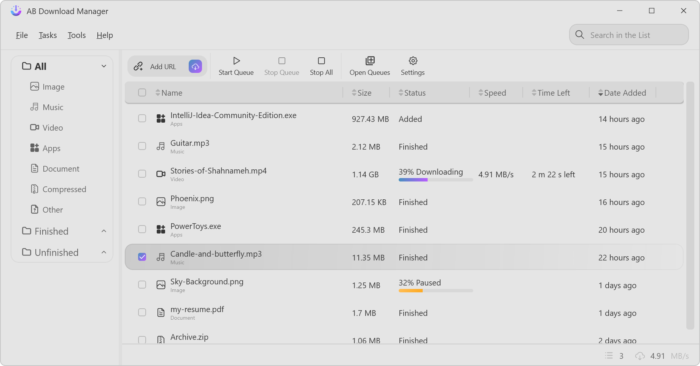

<div align="center">
  <a href="https://abdownloadmanager.com" target="_blank">
    
  </a>

  <h1>AB Download Manager</h1>
  <p><b>Fast. Open‑source. Cross‑platform download management.</b></p>

  <p>
    <a href="https://github.com/amir1376/ab-download-manager/releases/latest"></a>
    <a href="https://abdownloadmanager.com"></a>
    <a href="https://t.me/abdownloadmanager_discussion"></a>
    <a href="https://t.me/abdownloadmanager"></a>
    <a href="https://crowdin.com/project/ab-download-manager"></a>
  </p>
</div>

<a href="https://abdownloadmanager.com" target="_blank">
  
</a>

---

## ✨ Overview

**[AB Download Manager](https://abdownloadmanager.com)** is a modern, free, and open‑source desktop download manager designed to give you **maximum control, speed, and clarity** over your downloads.

Whether you’re handling large files, organizing queues, or integrating with your browser, AB Download Manager keeps things simple and fast.

---

## 🚀 Key Features

- ⚡ **High‑speed downloads** with optimized performance
- ⏰ **Queues & schedulers** for automated downloading
- 🌐 **Browser extensions** for seamless integration
- 💻 **Cross‑platform** support (Windows, Linux, macOS, Android)
- 🌙 **Multiple modern themes** (Light / Dark / Black & more)
- ❤️ **100% Free & Open Source**

👉 Learn more on the **[official website](https://abdownloadmanager.com)**.

---

## 📦 Installation

### Official Downloads

<a href="https://abdownloadmanager.com"></a> <a href="https://github.com/amir1376/ab-download-manager/releases/latest"></a>

---

### 🐧 Linux (Install Script)

```bash
bash <(curl -fsSL https://raw.githubusercontent.com/amir1376/ab-download-manager/master/scripts/install.sh)
```

### 🪟 Windows (winget / scoop)

**winget**

```bash
winget install amir1376.ABDownloadManager
```

**scoop**

```bash
scoop install extras/abdownloadmanager
```

### 🍎 macOS & Linux (Homebrew)

```bash
brew tap amir1376/tap && brew install --cask ab-download-manager
```

> ⚠️ **Security Warning**
> AB Download Manager is **NOT published** on Google Play or unofficial app stores.
> Any app claiming to be related to this project outside the links above should be considered **unsafe**.

📚 For alternative install methods, uninstallation steps, and FAQs, visit the **[Wiki](https://github.com/amir1376/ab-download-manager/wiki/)**.

---

## 🌐 Browser Extensions

Integrate AB Download Manager directly into your browser:

<p align="left">
<a href="https://addons.mozilla.org/firefox/addon/ab-download-manager/">
  
</a>
<a href="https://chromewebstore.google.com/detail/bbobopahenonfdgjgaleledndnnfhooj">
  <picture>
    <source media="(prefers-color-scheme: dark)" srcset="./assets/banners/chrome-extension_dark.png" />
    
  </picture>
</a>
</p>

---

## 🖼️ Screenshots

<div align="center">

<picture>
  <source media="(prefers-color-scheme: dark)" srcset="./assets/screenshots/app-home_dark.png">
  
</picture>

<picture>
  <source media="(prefers-color-scheme: dark)" srcset="./assets/screenshots/app-download_dark.png">
  
</picture>

</div>

---

## 🧪 Project Status

AB Download Manager is **actively developed** and still evolving 🚧

You may encounter bugs or incomplete features — your feedback helps shape the project!

- 💬 Join the **[Community](#community)**
- 🐛 Report issues via **GitHub Issues**
- 💡 Suggest features anytime

---

## 🤝 Community

Join the **[Telegram Discussion Group](https://t.me/abdownloadmanager_discussion)** to:

- Ask questions
- Report problems
- Suggest improvements
- Connect with other users

---

## 🧩 Related Repositories

There are multiple repositories related to the **AB Download Manager** project:

| Repository                                                                                     | Description              |
| ---------------------------------------------------------------------------------------------- | ------------------------ |
| **[Main Application](https://github.com/amir1376/ab-download-manager)**  (You are here)                      | Core desktop application |
| **[Browser Integration](https://github.com/amir1376/ab-download-manager-browser-integration)** | Browser extensions       |
| **[Website](https://github.com/amir1376/ab-download-manager-website)**                         | Official [website](https://abdownloadmanager.com/)  |

I've spent a lot of time to create this project.

If you like my work, please consider giving it a ⭐ — thanks! ❤️

---

## Bug Report

If you notice any bugs in the source code, please report them via the `GitHub Issues` section.

## 🛠️ Build From Source

To build the app locally:

1. Clone this repository
2. Download **[JetBrains Runtime (JBR)](https://github.com/JetBrains/JetBrainsRuntime/releases)** and:
   - Add it to your `PATH`, **or**
   - Set `JAVA_HOME` to its directory

3. Run:

```bash
./gradlew createReleaseFolderForCi
```

4. Output will be located at:

```
<project_dir>build/ci-release
```

> Builds are generated via **GitHub Actions** — see [`publish.yml`](./.github/workflows/publish.yml).

---

## 🌍 Translations

Help translate AB Download Manager on **[Crowdin](https://crowdin.com/project/ab-download-manager)**.

- ❌ Please don’t submit translations via pull requests
- ➕ To request a new language, see [issue #144](https://github.com/amir1376/ab-download-manager/issues/144)

---

## 🤲 Contributing

Contributions are welcome!

Please read **[CONTRIBUTING.md](CONTRIBUTING.md)** before submitting PRs.

---

## ❤️ Support the Project

If you enjoy AB Download Manager, consider supporting its development ⭐

Donation details are available in **[DONATE.md](DONATE.md)**.

Thanks for being part of the project!
