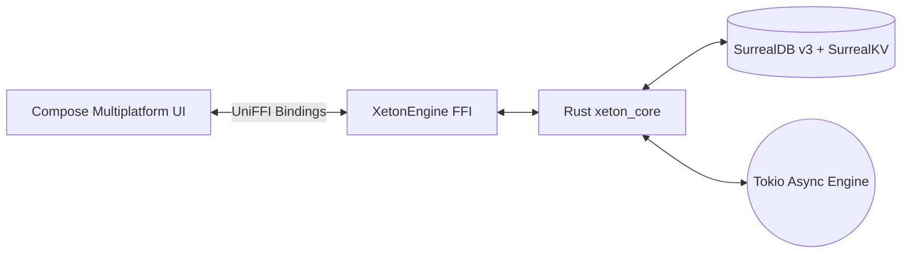

<div align="center">
# Xeton

**High-performance desktop download manager powered by a Tokio-based Rust core and Compose Multiplatform.**

[](LICENSE)
[](https://crowdin.com/project/xeton-download-manager)
[](https://t.me/Amir_Ai)
</div>

---

## 📖 Description

[Xeton](https://xeton.app) is a high-performance desktop download manager designed to utilize your bandwidth to its absolute limit. By combining the safety and extreme concurrency of **Rust** in the backend with the reactive beauty of **Compose Multiplatform** in the frontend, Xeton offers a premium, modern, and lightning-fast download experience.

## 🏗️ Architecture

Xeton split its architecture to combine the strengths of both Rust and Kotlin:


```mermaid
graph LR
    UI[Compose Multiplatform UI] <-->|UniFFI Bindings| FFI[XetonEngine FFI]
    FFI <--> Core[Rust xeton_core]
    Core <--> DB[(SurrealDB v3 + SurrealKV)]
    Core <--> Net((Tokio Async Engine))
```

- **Frontend:** Written in Kotlin using **Compose Multiplatform**, providing a single reactive UI across Windows, macOS, and Linux.
- **Backend Core (`xeton_core`):** Written in **Rust** using **Tokio** to run asynchronous tasks. It replaces the legacy JVM-based thread-per-connection downloader, allowing scaling up to 256 download threads per task with zero OS thread bloat.
- **Persistence:** Powered by **SurrealDB v3** with an embedded **SurrealKV** storage engine, providing transactional ACID storage fully in-process.

## 🛠️ Built With

- **[Rust](https://www.rust-lang.org/):** Core engine, protocol clients, and extractors.
- **[Tokio](https://tokio.rs/):** Driving the non-blocking concurrent downloading runtime.
- **[Compose Multiplatform](https://www.jetbrains.com/lp/compose-multiplatform/):** For a beautiful, responsive desktop GUI.
- **[SurrealDB v3](https://surrealdb.com/):** Embedded document database.
- **[UniFFI](https://github.com/mozilla/uniffi-rs):** Type-safe FFI binding generation between Kotlin and Rust.
- **[FFmpeg](https://ffmpeg.org/):** Lossless in-memory audio extraction and container conversion.

## ✨ Features

- ⚡ **256 Concurrent Connections:** Scale up to 256 connections per download task without thread overhead or context-switching bloat.
- 💾 **ACID Database Engine:** Embedded transactional SurrealDB ensures your download states are saved instantly and safely.
- 🌐 **Multi-Protocol Power:** Native engines for HTTP/HTTPS, FTP/FTPS, and BitTorrent (P2P) with peer discovery, DHT, and magnet links.
- 🎥 **Media Extractor Pipeline:** Seamlessly extract direct download URLs from YouTube, TikTok, Instagram, Spotify, SoundCloud, and more.
- 🎵 **Lossless Audio Transcoder:** Extract and convert video to MP3, M4A, or Opus on-the-fly in-memory, avoiding temporary disk usage.
- 📅 **Smart Scheduler & Queues:** Plan and automate download starts, stops, and bandwidth limits.
- 🎨 **Modern Interface:** Curated dark, light, and black themes with smooth animations.
- 🌐 **Browser Extensions:** Integrations for Firefox and Chrome to capture links automatically.

## 🚀 Installation

### 📦 Desktop Application

| Platform | Method | Command |
| :--- | :--- | :--- |
| **Linux** | Shell Script | `bash <(curl -fsSL https://raw.githubusercontent.com/amir1376/xeton-download-manager/master/scripts/install.sh)` |
| **Windows** | Winget | `winget install amir1376.Xeton` |
| **Windows** | Scoop | `scoop install extras/xeton-download-manager` |
| **macOS / Linux** | Homebrew | `brew tap amir1376/tap && brew install --cask xeton-download-manager` |

> ⚠️ **Warning:** This software is NOT on Google Play or other app stores unless listed here. Any version **claiming to be or related to this project** should be considered SCAM and UNSAFE.

### 🌐 Browser Extensions

Integrate Xeton directly into your browsing experience:

* [Firefox Extension](https://addons.mozilla.org/firefox/addon/xeton-download-manager/)
* [Chrome Extension](https://chromewebstore.google.com/detail/bbobopahenonfdgjgaleledndnnfhooj)

## 🤝 Support & Feedback

Xeton is in active development. Your feedback helps us grow!

* **Report Issues:** Use `GitHub Issues` for bug reports and feature requests.
* **Community:** Chat with us and get support in our Telegram Discussion Group.

## 📚 Project Structure

| Repository | Description |
|---|---|
| [Main Application](https://github.com/amir1376/xeton-download-manager) (You are here) | Contains the Compose frontend and the Rust backend `xeton_core` |
| [Browser Integration](https://github.com/amir1376/xeton-download-manager-browser-integration) | Contains the browser extension codebase |
| [Website](https://github.com/amir1376/xeton-download-manager-website) | Contains the official website ([xeton.app](https://xeton.app)) |

## 🏗️ Build From Source

To compile and run Xeton locally, you will need:
- **JDK 17+** (JetBrains Runtime recommended)
- **Rust Toolchain** (latest stable `rustc` and `cargo`)
- **FFmpeg** installed on your system (for audio transcoding features)

### Steps

1. **Clone the repository:**
   ```bash
   git clone https://github.com/amir1376/xeton-download-manager.git
   cd xeton-download-manager
   ```

2. **Build the Rust Core and bindings:**
   The Gradle build integrates with Cargo to compile the FFI static library and generate Kotlin bindings automatically:
   ```bash
   ./gradlew buildRustCore
   ```

3. **Run the application:**
   ```bash
   ./gradlew :desktop:run
   ```

## 🌐 Translations

Help translate Xeton into another language or improve existing translations on Crowdin:

* Visit the project on [Crowdin](https://crowdin.com/project/xeton-download-manager).
* **Please DO NOT submit translations via GitHub pull requests.**
* To add a new language, see [this issue](https://github.com/amir1376/xeton-download-manager/issues/144).

## 💡 Contributing

Contributions are welcome! Please check our [Contributing Guide](CONTRIBUTING.md) to understand our coding guidelines and FFI boundaries before getting started.

## ❤️ Support

If you find Xeton useful, please consider:
- Giving this repository a ⭐
- Supporting the project financially via [DONATE.md](DONATE.md).