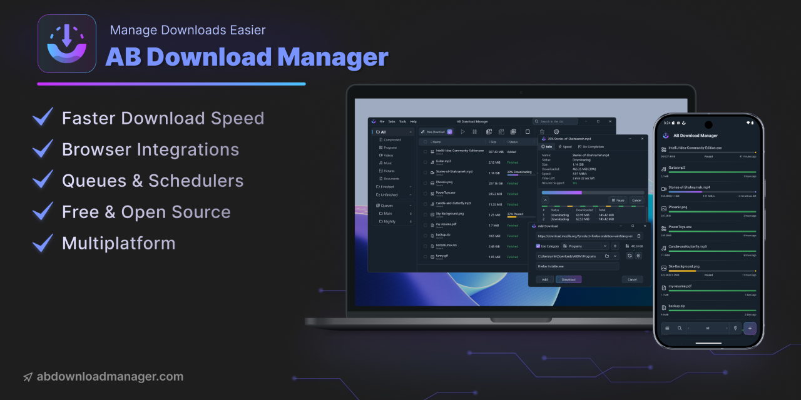
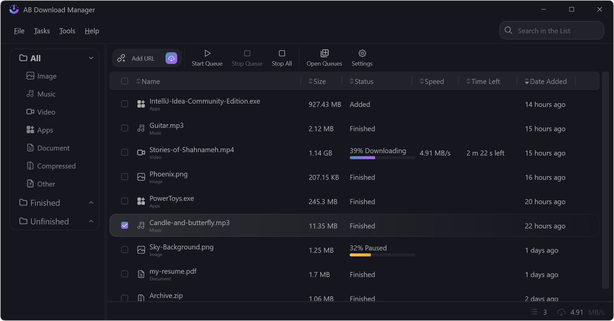
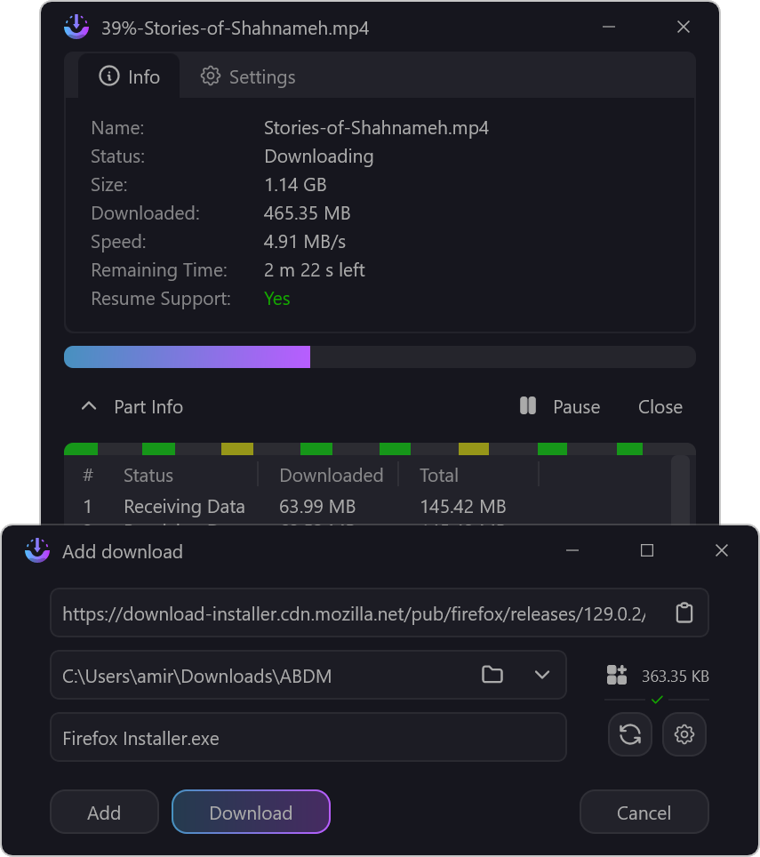

<div align="center">
<a href="https://xeton.app" target="_blank">
    
</a>

# Xeton

**High-performance download management for the modern desktop.**

[](https://github.com/amir1376/xeton-download-manager/releases/latest)
[](https://xeton.app)
[](https://t.me/xeton_app)
[](https://crowdin.com/project/xeton-download-manager)
<a href="https://xeton.app" target="_blank">
    
</a>
</div>

## 📖 Description

[Xeton](https://xeton.app) is a high-performance desktop application designed to help you manage and organize your downloads with maximum efficiency.

## 🛠️ Built With

Xeton is built using modern cross-platform technologies to ensure performance and native feel:
- **[Compose Multiplatform](https://www.jetbrains.com/lp/compose-multiplatform/):** For a beautiful, reactive UI.
- **[Kotlin](https://kotlinlang.org/):** The primary language for robust and safe code.
- **[Gradle](https://gradle.org/):** Reliable build automation.

## ✨ Features

- ⚡ **Faster Download Speed:** Optimize your bandwidth with multi-part downloading.
- 📅 **Queues & Schedulers:** Plan your downloads for the most convenient times.
- 🌐 **Browser Extensions:** Seamless integration with your favorite browsers.
- 💻 **Multiplatform:** Support for Windows, Linux, and macOS.
- 🎨 **Modern UI:** Multiple themes (Dark, Light, Black) with a sleek, intuitive interface.
- ❤️ **Open Source:** Completely free and open for community contribution.

## 🚀 Installation

### 📦 Desktop Application

| Platform | Method | Command |
| :--- | :--- | :--- |
| **Linux** | Shell Script | `bash <(curl -fsSL https://raw.githubusercontent.com/amir1376/xeton-download-manager/master/scripts/install.sh)` |
| **Windows** | Winget | `winget install amir1376.Xeton` |
| **Windows** | Scoop | `scoop install extras/xeton-download-manager` |
| **macOS / Linux** | Homebrew | `brew tap amir1376/tap && brew install --cask xeton-download-manager` |

> ⚠️ **Warning:** This software is NOT on Google Play or other app stores unless listed here. Any version **claiming to be or related to this project** should be considered SCAM and UNSAFE.

For alternative installation methods and uninstallation instructions, please refer to our Wiki.

### 🌐 Browser Extensions

Integrate Xeton directly into your browsing experience.

<div align="center">

<a href="https://addons.mozilla.org/firefox/addon/xeton-download-manager/">
    <picture>
        
    </picture>
</a>
&nbsp;
<a href="https://chromewebstore.google.com/detail/bbobopahenonfdgjgaleledndnnfhooj">
    <picture>
        <source media="(prefers-color-scheme: dark)" srcset="./assets/banners/chrome-extension_dark.png" height="42">
        <source media="(prefers-color-scheme: light)" srcset="./assets/banners/chrome-extension_light.png" height="42">
        
    </picture>
</a>

</div>

## 🖼️ Screenshots

<div align="center">
<picture>
  <source media="(prefers-color-scheme: dark)" srcset="./assets/screenshots/app-home_dark.png">
  <source media="(prefers-color-scheme: light)" srcset="./assets/screenshots/app-home_light.png">
  
</picture>

<picture>
  <source media="(prefers-color-scheme: dark)" srcset="./assets/screenshots/app-download_dark.png">
  <source media="(prefers-color-scheme: light)" srcset="./assets/screenshots/app-download_light.png">
  
</picture>
</div>

## 🤝 Support & Feedback

Xeton is in active development. Your feedback helps us grow!

*   **Report Issues:** Use `GitHub Issues` for bug reports and feature requests.
*   **Community:** Chat with us and get support in our Telegram Discussion Group.

## 📚 Project Structure

The Xeton project is composed of several repositories:

| Repository                                                                                 | Description                                                                   |
|--------------------------------------------------------------------------------------------|-------------------------------------------------------------------------------|
| [Main Application](https://github.com/amir1376/xeton-download-manager) (You are here)         | Contains the **Application** that runs on your **device**                   |
| [Browser Integration](https://github.com/amir1376/xeton-download-manager-browser-integration) | Contains the **Browser Extension** to be installed on your **browser**       |
| [Website](https://github.com/amir1376/xeton-download-manager-website)                         | Contains the **Xeton** [website](https://xeton.app) |

## 🏗️ Build From Source

To compile and test the desktop app on your local machine, follow these steps:

1. **Clone the project.**
2. **Configure JBR:** Download the JetBrains Runtime (JBR) and:
    - Add it to your `PATH`, or
    - Set `JAVA_HOME` to its path.
3.  Navigate to the project directory, open your terminal and execute the following command:

    ```bash
    ./gradlew createReleaseFolderForCi
    ```

4.  The output will be available at:

    ```
    <project_dir>/build/ci-release
    ```

> [!TIP]
> This project is automatically published via [GitHub Actions](./.github/workflows/publish.yml). Refer to the workflow file for CI-specific environment details.

## 🌐 Translations

If you’d like to help translate Xeton into another language, or improve existing translations, you can do so on Crowdin:

*   Visit the project on [Crowdin](https://crowdin.com/project/xeton-download-manager).
*   Please **DO NOT** submit translations via pull requests.
*   If you want to add a new language, please see [this issue](https://github.com/amir1376/xeton-download-manager/issues/144).

## 💡 Contributing

Contributions are welcome! Please check our [Contributing Guide](CONTRIBUTING.md) before getting started.

## ❤️ Support

If you find Xeton useful, please consider:
- Giving this repository a ⭐
- Supporting the project financially via [DONATE.md](DONATE.md).